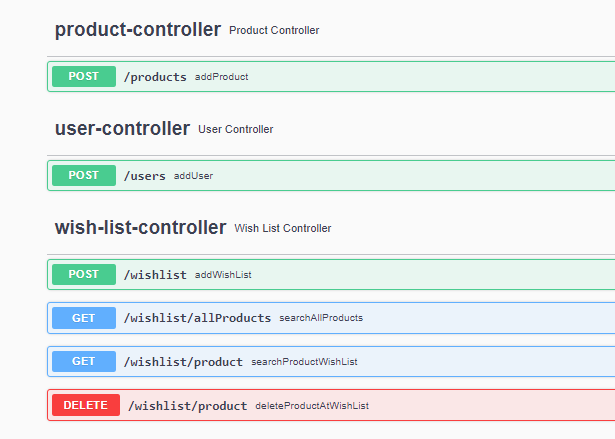

# Wishlist

 Projeto criado em Java 11 onde é possível adicionar produtos, usuários e criar Wishlists
 (listas de desejos) associando os produtos que um usuário tem em sua Wishlist

## Tecnologias

* Java 11
* Maven
* MongoDB
* SpringBoot
* JUnit

## Como Buildar
1. Clonar o repositório:

```bash
https://github.com/lucassenazuza/wishlist
```

2. Buildar Aplicação

```bash
mvn clean install
```
4. Rodar Aplicação

Para Testes locais, foi usado o docker-compose, através do script fornecido é possível
baixar e rodar uma imagem do mongoDB com o comando

```bash
docker-compose up -d
```
Após a imagem docker está de pé, e o banco wishlistdb ser criado, é possível rodar a aplicação
com o comando
```bash
mvn spring-boot:run -Dspring-boot.run.profiles=dev
```

4. Rodar Testes

```bash
mvn test
```
5. Swagger


Swagger pode ser acessado pela rota: http://localhost:5000/swagger-ui/index.html


6. Rotas

